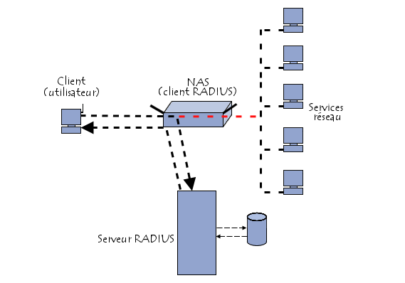

### FreeRADIUS
FreeRADIUS est un serveur RADIUS libre. Il offre une alternative aux autres serveurs d'entreprise RADIUS, et est un des serveurs RADIUS les plus modulaires et riches en fonctionnalités disponibles aujourd'hui.  

Le protocole Radius permet à la fois l’authentification des administrateurs sur les équipements réseau actifs, et pour les accès en tant qu’utilisateur sur les différents services réseau.  

- **Basé sur le modéle de sécurité AAA** (Authentication Authorization Accounting)
- **Cas d'utilisations**
  1. Contrôler l'accés à un réseau wifi
  2. Contrôler l'accés à un switch
  3. Contrôler l'accés à un MSAN
- **Entités**
  1. Supplicant ou terminal de l'utilisateur
  2. Client RADIUS appelé NAS (Serveur d'Accés Réseau)
  3. Serveur RADIUS


- **Le fonctionnement de RADIUS est basé sur un scénario proche de celui-ci** :
>   1. Un utilisateur envoie une requête au NAS afin d'autoriser une connexion à distance ;  
    1. Le NAS achemine la demande au serveur RADIUS ;  
    2. Le serveur RADIUS consulte la base de données d'identification afin de connaître le type de scénario d'identification demandé pour l'utilisateur. Soit le scénario actuel convient, soit une autre méthodes d'identification est demandée à l'utilisateur.  
    Le serveur RADIUS retourne ainsi une des quatre réponses suivantes :  
        **ACCEPT** : l'identification a réussi ;  
        **REJECT** : l'identification a échoué ;  
        **CHALLENGE** : le serveur RADIUS souhaite des informations supplémentaires de la part de l'utilisateur et propose un « défi » (en anglais « challenge ») ;  
        **CHANGE PASSWORD** : le serveur RADIUS demande à l'utilisateur un nouveau mot de passe.   

Suite à cette phase dit d'authentification, débute une phase d'autorisation où le serveur retourne les autorisations de l'utilisateur. 

Schéma récaputilatif:  


Couplé à un annuaire LDAP, qui sert de base d’utilisateurs, il devient possible d’utiliser une base d’utilisateurs uniques pour les applications également. Les protocoles RADIUS et LDAP sont des standards définis par l’IEEE, et la plupart des applications sont aujourd’hui compatibles avec ces protocoles. Il devient ainsi plus simple de déployer de nouvelles applications au sein de votre infrastructure. Avec ce système, vos utilisateurs effectuent une ré-authentification unique valable pour tous les équipements lors de la réinitialisation ou du changement de leur mot de passe.


### Installation et configuration d'un serveur RADIUS avec un annuaire LDAP sous ubuntu(20.04)

NB: On suppose qu'on a déja installé et configuré notre serveur LDAP

#### Installation des paquets

``` shell
sudo apt update
sudo apt install freeradius freeradius-utils freeradius-ldap 
```
#### Configuration 
- Créer un compte pour le client (un modem dans notre cas)
    >```shell
    sudo nano /etc/freeradius/3.0/clients.conf
    ```
    ajouter l'adresse du modem et le secret
    ```shell
    client 192.168.0.50 {
            secret = passer123
    }
    ```
- Configurer la prise en charge de LDAP:
    >``` shell
    sudo nano /etc/freeradius/3.0/sites-available/default 
    ```
    Enlever le "-" devant "ldap"
    ```shell
            #
            #  The ldap module reads passwords from the LDAP database.
            ldap
    ```
- Activer l'Authentification avec LDAP
  >toujours dans le même fichier dans la section authenticate
  ``` shell
 #  LDAP servers do not.
        #
        Auth-Type LDAP {
                ldap
        }
  ```
  dans la section post-auth décommenter ldap
  ```shell
  #  Un-comment the following if you want to modify the user's object
        #  in LDAP after a successful login.
        #
        ldap
  ```
- Donner les paramètres de connexion
    >```shell
     sudo nano /etc/freeradius/3.0/mods-available/ldap
    ```
    L'adresse ip et le port
    ```shell
        #  - ldaps:// (LDAP over SSL)
        #  - ldapi:// (LDAP over Unix socket)
        #  - ldapc:// (Connectionless LDAP)
        server = 'localhost'
    #       server = 'ldap.rrdns.example.org'
    #       server = 'ldap.rrdns.example.org'
        #  Port to connect on, defaults to 389, will be ignored for LDAP URIs.
        port = 389
    ```
    Le dn et le mot de passe de l'administrateur
    ```shell
    #  Administrator account for searching and possibly modifying.
    #  If using SASL + KRB5 these should be commented out.
    identity = 'cn=admin,dc=esp,dc=sn'
    password = passer
    ```
    La base pour les recherches
    ```shell
    #  Unless overridden in another section, the dn from which all
    #  searches will start from.
    base_dn = 'dc=esp,dc=sn'
    ```
    Faire le mapping des attributs: 
    1. mot de passe
     ```shell
    update {
                    control:Password-With-Header    += 'userPassword'
                    control:Cleartext-Password      += 'userPassword'
    #               control:NT-Password             := 'ntPassword'
    #               reply:Reply-Message             := 'radiusReplyMessage'
    #               reply:Tunnel-Type               := 'radiusTunnelType'
    #               reply:Tunnel-Medium-Type        := 'radiusTunnelMediumType'
    #               reply:Tunnel-Private-Group-ID   := 'radiusTunnelPrivategroupId'
                    #  Where only a list is specified as the RADIUS attribute,
                    #  the value of the LDAP attribute is parsed as a valuepair
                    #  in the same format as the 'valuepair_attribute' (above).
                    control:                        += 'radiusControlAttribute'
                    request:                        += 'radiusRequestAttribute'
                    reply:                          += 'radiusReplyAttribute'
            }
    ```
    1. login
    ```shell
    user {
                #  Where to start searching in the tree for users
                base_dn = "${..base_dn}"
                #  Filter for user objects, should be specific enough
                #  to identify a single user object.
                #
                #  For Active Directory, you should use
                #  "samaccountname=" instead of "uid="
                #
                filter = "(uid=%{%{Stripped-User-Name}:-%{User-Name}})"
                #  SASL parameters to use for user binds
                #
                #  When we're prompted by the SASL library, these control
                ...
    ```
- Activer le module 
    >```shell
    ln -s /etc/freeradius/3.0/mods-available/ldap /etc/freeradius/3.0/mods-enabled/
    ```
