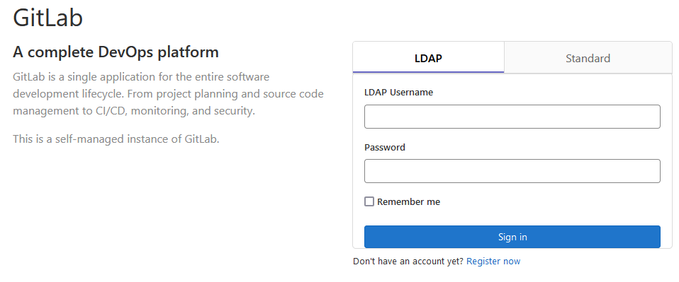

La plateforme tout-en-un de GitLab permet de planifier des projets et de gérer le code source, l'approche CI/CD, et la sécurité. Elle constitue une source unique pour tous les utilisateurs, indépendamment du rôle qu'ils exercent. Donnez à vos équipes les moyens d'innover rapidement en supprimant les complexités de la chaîne d'outils et en améliorant la visibilité d'une extrémité à l'autre.

### Installation et configuration de Gitlab avec un annuaire LDAP sous ubuntu(20.04)

#### Installation de gitlab

- Installer les dépendences
```shell
sudo apt update
sudo apt-get install -y curl openssh-server ca-certificates tzdata perl
```
- Ajouter le dépot et intaller le paquet
```shell
curl https://packages.gitlab.com/install/repositories/gitlab/gitlab-ee/script.deb.sh | sudo bash
```

- Lancer Gitlab avec la commande
```shell
sudo gitlab-ctl start
```

#### Configuration de LDAP

```shell
sudo nano /etc/gitlab/gitlab.rb
```
Renseigner les paramètres de l'annuaire
```shell
### LDAP Settings
###! Docs: https://docs.gitlab.com/omnibus/settings/ldap.html
###! **Be careful not to break the indentation in the ldap_servers block. It is
###!   in yaml format and the spaces must be retained. Using tabs will not work.**

 gitlab_rails['ldap_enabled'] = true
 gitlab_rails['prevent_ldap_sign_in'] = false

###! **remember to close this block with 'EOS' below**
gitlab_rails['ldap_servers'] = YAML.load <<-'EOS'
   main:
# 'main' is the GitLab 'provider ID' of this LDAP server
     label: 'LDAP'
     host: '127.0.0.1'
     port: 389
     uid: 'uid'
     bind_dn: 'cn=admin,dc=esp,dc=sn'
     password: 'passer'
     encryption: 'plain' # "start_tls" or "simple_tls" or "plain"
     verify_certificates: false
#     smartcard_auth: false
#     active_directory: true
     allow_username_or_email_login: false
     lowercase_usernames: false
#     block_auto_created_users: false
     base: 'ou=dic2,ou=telecoms,ou=dgi,dc=esp,dc=sn'
     user_filter: '(&(objectclass=inetOrgPerson)(objectclass=simpleSecurityObject))'
     attributes:
       username: ['uid']
       email: ['mail']
       name: ['displayName']
#     ## EE only
     group_base: ''
     admin_group: ''
     sync_ssh_keys: false
#

```

#### Maintenant vous pouvez vous connecter à gitlab avec les utilisateurs dans l'annuaire



