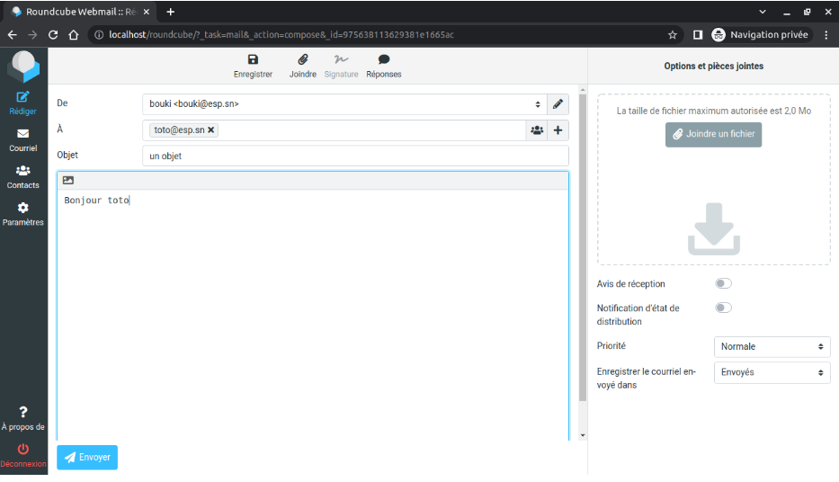
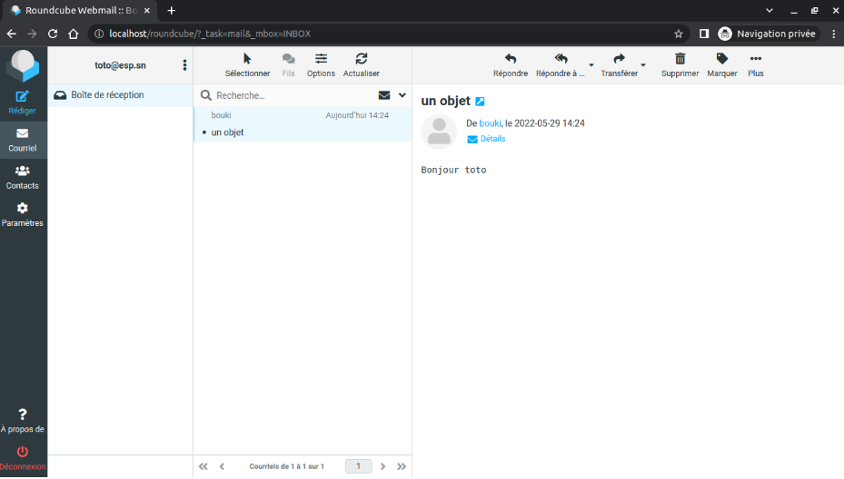

### 1. **Le service de messagerie  est composé essentiellement de trois programmes appelés agents de messagerie** :
- Il s’agit du **MUA** (Mail User Agent) qui s’occupe de la lecture ou de l’écriture de mail ; on l’appelle client de messagerie ; Ex thunderbird,roundcube.
- **MTA** (Mail Transfer Agent) qui s’occupe de la réception des mails venant des clients et de leurs transferts ; on l’appelle serveur SMTP ; Ex postfix.
- **MDA** (Mail Deliver Agent) qui s’occupe de la distribution des mails dans les boîtes des utilisateurs ; Ex dovecot.
### 2. **Il y a essentiellement quatre protocoles de messagerie**
- Le protocole **SMTP** (Simple Mail Transfer Protocol) utilisé par un MUA pour envoyer un mail à son MTA ou par un MTA pour envoyer un mail à un homologue MTA.
- Le protocole **POP** (Post Office Protocol) qui permet à un client de demander à ce qu’on lui transfère tous ses mails.
- Le protocole **IMAP** (Internet Mail Access Protocol) qui permet à un client de se connecter et de manipuler à distance ses mails.
- Le protocole **MIME** (Multipurpose Internet Mail Extension) qui s’occupe de l’attachement des fichiers multimédias aux mails ; En réalité MIME est un format de donnée qui permet à un client de distinguer le corps du mail des fichiers attachés.
NB : Un serveur SMTP écoute par défaut sur le port 25 et utilise TCP, Un serveur POP écoute sur le port 110 et un serveur IMAP sur le port 143.
Un serveur de messagerie c’est le couple MDA&MTA
### 3. **L’adresse email d’un utilisateur sur un serveur de messagerie est de la forme**  
login@nomd’hote.nomcompletdomaine mais pour des raisons de sécurité et autres on préfère que l’adresse soit de la forme login@nomcompledomaine et demander au serveur DNS d’indiquer la liste des serveurs de messagerie de son domaine grâce à l’enregistrement de type MX
### 4. **Il y a deux manières de stocker les mails sur un serveur de messagerie** :  
- **Format mailbox** : on stocke tous les mails d’un utilisateur dans un même fichier.
- **Format maildir** : on crée un dossier pour chaque utilisateur et à l'intérieur on met chaque mail qui arrive dans un fichier à part.


---

### Installation et configuration d'un serveur de messagerie sous ubuntu(20.04)

**NB**: Il faut au préalable avoir un utilisateur mysql
#### Installation des paquets

``` shell
sudo apt update
sudo apt install  postfix dovecot-pop3d dovecot-imapd roundcube roundcube-mysql
```
#### Configuration 
- Config de **postfix** (serveur SMTP)
  
    ``` shell
    sudo nano /etc/postfix/main.cf
    ```
    Modifier les paramètres suivants:
    >mydestination permet au serveur de distinguer les mails qui sont pour lui
    ``` shell
    myorigin = esp.sn
    mydestination = esp.sn
    ```
    Choisir le format maildir
    ``` shell
    home_mailbox = Maildir/
    ```
    Redémarrer le serveur postfix
    ``` shell
    sudo service postfix restart
    ```

- Config du **MDA**
    ``` shell
    sudo nano /etc/dovecot/conf.d/10-mail.conf
    ```
    Modifier les paramètres suivants:
    >desactiver mailbox
    ``` shell
   #mail_location = mbox:~/mail:INBOX=/var/mail/%u
    ```
    activer maildir
    ``` shell
    mail_location = maildir:~/Maildir
    ```
    Redémarrer le serveur dovecot
    ``` shell
    sudo service dovecot restart
    ```
- Héberger le serveur **roundcube**
    
    ``` shell
    sudo nano /etc/apache2/conf-available/roundcube.conf
    ```
    Modifier les paramètres suivants:

    >décommenter Alias
    ``` shell
    # Uncomment them to use it or adapt them to your configuration
    Alias /roundcube /var/lib/roundcube
    ```
    Redémarrer apache
    ``` shell
    sudo service apache2 restart
    ```
- Configurer **roundcube**
    ``` shell
    sudo nano /var/lib/roundcube/config/config.inc.php
    ```
    Modifier les paramètres suivants:

    >nom d'hôte du serveur imap
    ``` shell
    $config['default_host'] = 'esp.sn';
    ```
    adresse ip et port du serveur smtp
    ``` shell
    $config['smtp_server'] = 'localhost';
    // SMTP port. Use 25 for cleartext, 465 for Implicit TLS, or 587 for STARTTLS (default)
    $config['smtp_port'] = 25;
    ```
    désactiver l'authentification
    ``` shell
    // SMTP username (if required) if you use %u as the username Roundcube
    // will use the current username for login
    $config['smtp_user'] = '';
    // SMTP password (if required) if you use %p as the password Roundcube
    // will use the current user s password for login
    $config['smtp_pass'] = '';
    ```
- faire le résolution de esp.sn
    ```shell
    sudo nano /etc/hosts
    ```
    ajouter
    ``` shell
    127.0.0.1       localhost esp.sn mail.esp.sn
    ```
- accéder au webmail avec l’adresse mail.esp.sn
    ```shell
    sudo nano /etc/apache2/sites-available/mail.conf
    ```
    ajouter
    ```shell
    <VirtualHost *:80>
    ServerName mail.esp.sn
    DocumentRoot /var/lib/roundcube
    DirectoryIndex index.php
    </VirtualHost>
    ```
    activer le site
    ```shell
    sudo a2ensite mail.conf
    ```
    redémarrer apache

    ```shell
    sudo service apache2 restart 
    ```

    ---

    
    