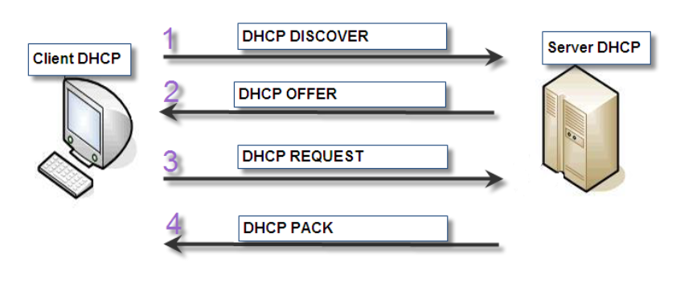

Dynamic Host Configuration Protocol est un protocole réseau chargé de la configuration des adresses IP d’un réseau informatique. Il évite ainsi à l’utilisateur qui se connecte pour la première fois, d’avoir à configurer la pile IP de son équipement.



- **DHCP DISCOVER** : Requête de localisation  des serveurs DHCP disponibles.  
- **DHCP OFFER**  : Réponse du serveur à un paquet DHCPDISCOVER, contenant les premiers paramètres DHCP.  
- **DHCP REQUEST**  : Requête du client pour annoncer qu’il à accepté une offre ou pour prolonger son bail.  
- **DHCP PACK**  : Réponse du serveur pour signaler au client que son bail est expiré ou si le client annonce une mauvaise configuration réseau.  

---
  
### installation et configuration d'un serveur DHCP sous ubuntu(20.04)

#### Installation des paquets

``` shell
sudo apt-get update
sudo apt-get install isc-dhcp-server
```
#### Configuration basique

**Etapes de la configurations**:
1. Dire dans quel réseau mettre les clients
2. La plage d'adresse
3. Les options que l'on veut activer
4. La passerelle à donner aux clients
5. Le DNS que l'on veut donner aux clients 


``` shell
subnet 192.168.1.0 netmask 255.255.255.0 {
  range 192.168.1.20 192.168.1.20; 
  option routers 192.168.1.1;
  option domain-name-servers 192.168.1.130;
}
```
