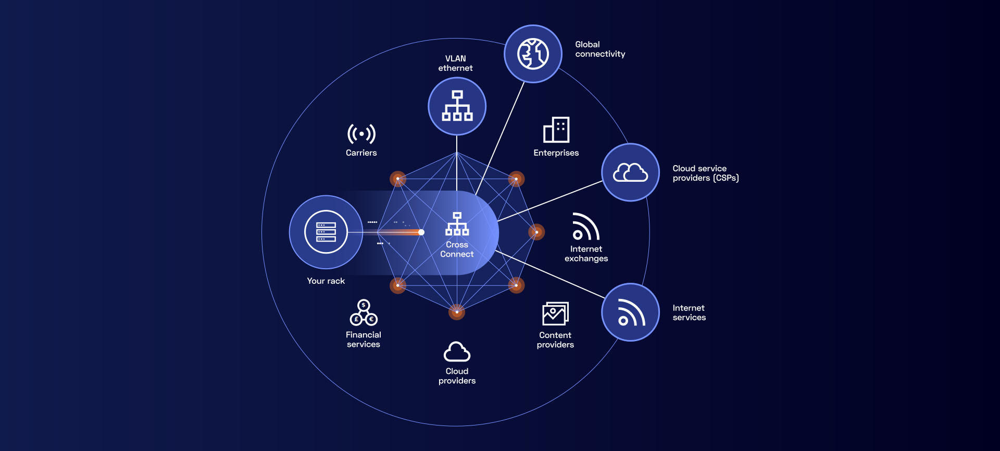

# Intro - Services Réseaux
  **Pr. Ouya**

## Introduction

Mettre en réseau des équipements informatique permet de les faire communiquer de façon à ce que certains
d'entre eux puisse offrir leurs services aux autres (« partage de ressources » et de compétences).

Les services réseau sont utilisés depuis plusieurs années dans le but de pouvoir faciliter la communication entre deux ou plusieurs ordinateurs. Ceci afin de partager des ressources, qu’elles soient matérielles ou logicielles telles que des programmes, des applications, des informations, des données, des fichiers, entre autres.
Par la suite nous allons faire l’implémentation de quelques-uns de ces services.

## Quelques Définitions

#### Logiciel serveur

> Un logiciel serveur donne à un ordinateur la compétence d'offrir un service à d'autres machines.

#### Logiciel client

> Un logiciel client donne à un ordinateur la compétence d'utiliser les services offerts par un serveur.

#### Protocole

>Un protocole informatique est un ensemble de règles qui régissent les échanges de données ou le comportement collectif de processus ou d'ordinateurs  en réseaux ou d'objets connectés.

#### Port

 >la notion de port logiciel permet, sur un ordinateur donné, de distinguer différents interlocuteurs. Ces interlocuteurs sont des programmes informatiques qui, selon les cas, écoutent ou émettent des informations sur ces ports. Un port est distingué par son numéro. 
